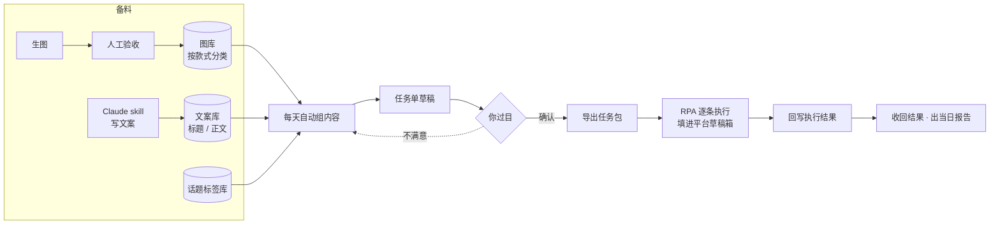
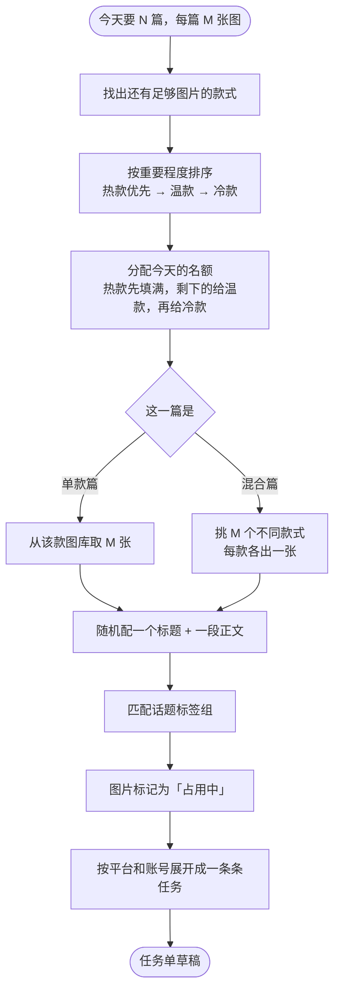
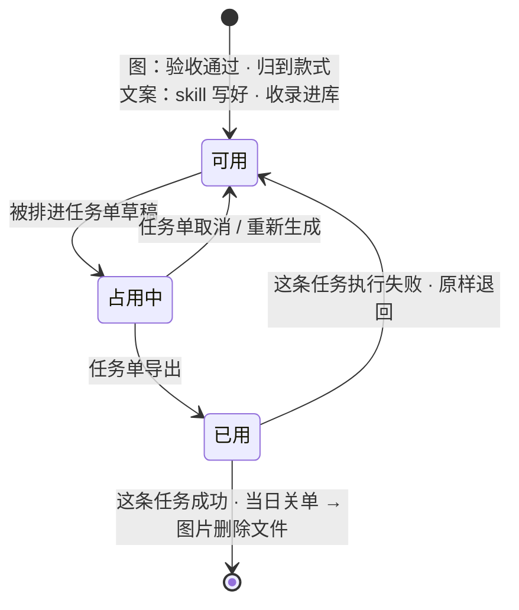
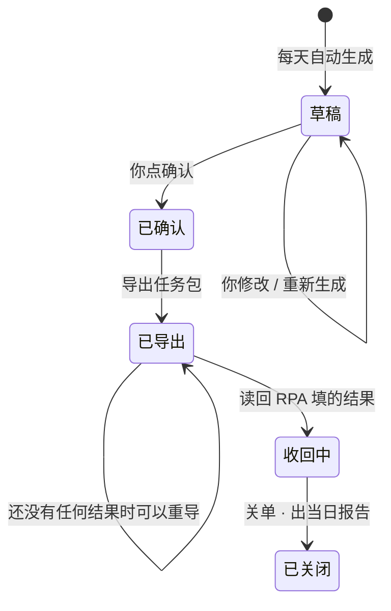

# 图文内容任务单发布 · 需求文档

> ⚠️ **本文部分条目已于 2026-08-01 被推翻**，以 `图文发布链路重构_方案.md` 为准。
> 已失效的有五条：§5.6「不需要计划发布时间」· §5.4「每个平台发一模一样的内容」·
> §5.4「发布平台数量可自行增删」· §11「平台限制校验暂不做」· §5.4「每平台多账号」。
> 另新增了「商品」这一层（在 SKU 之上），文案/话题/任务单/平台范围全部上移到商品级。
> 本文其余部分（素材一生、确认关卡、失败退回、用过即删）仍然成立。

> 本文只描述**要做成什么样**，不涉及怎么实现。技术方案另行讨论。
>
> 内容来自 2026-07-29 的需求梳理对话，目的是把「想到哪说到哪」的口头需求
> 固定成可以逐条挑刺的形式。
>
> 每条都标了来源：**【定】** = 你明确说过的 · **【默】** = 我替你补的默认值，可推翻 ·
> **【待】** = 还没定。

---

## 1. 背景

你每天有大量图文内容要发布到各个平台。

- **图片**：由 GenDesk 自己的生图功能产出，人工验收通过后使用。
- **文案**：由 Claude Code 的 skill 产出。
- **发布**：不是人手动发，而是把内容整理成一张任务单，交给 RPA 逐条执行。

现在缺的是中间那一段：**图片和文案都有了，但没有一个顺手的地方把它们组合成
「一篇可发布的内容」，再批量变成任务单。**

软件里现有的发布相关功能（作品库、素材包、发布计划）是按另一种运营方式设计的，
与你实际的做法对不上。**你已明确：这些都可以推翻重做，不必迁就。**

---

## 2. 一句话概括

> 每天从按款式分类的图库里挑出 N 篇内容（每篇 M 张图，可以单款也可以多款混搭），
> 配上文案库里的标题、正文和对应的话题标签，
> 你过目确认后导出一张任务单，RPA 逐条把内容填进各平台的草稿箱并回写执行结果。

---

## 3. 关键概念

| 词                | 含义                                               |
| ---------------- | ------------------------------------------------ |
| **款式（SKU）**      | 一个明星款式。不同款式吸引不同标签的人群，所以「这篇内容面向谁」由它用了哪些款式决定       |
| **热款 / 温款 / 冷款** | 款式的重要程度分层。**只影响每天优先发谁**，不代表「周几发」                 |
| **图库**           | 验收通过的图片，按款式分类存放，等着被用                             |
| **一篇**           | 一条待发布的图文内容 = 标题 + 正文 + 话题标签 + 若干张有顺序的图。这是发布的最小单元 |
| **单款篇**          | 一篇里的图全部来自同一个款式                                   |
| **混合篇**          | 一篇里用了多个款式，**每个款式各出一张图**，让内容显得款式丰富                |
| **话题标签库**        | 事先配好的标签组合，按「某个款 / 某几个款的组合 / 通用」分类存放，不用每次现想       |
| **任务单**          | 一天一张表格。软件填内容，RPA 填执行结果，两边共同维护                    |
| **任务包**          | 一次导出的完整交付物：任务单 + 图片 + 执行说明 + 一个「准备好了」的标志文件       |
| **存草稿**          | RPA 的完成动作是把内容填进平台的草稿箱，**不等于已经发出去了**（见 §9 盲区）     |

---

## 4. 全流程

---

## 5. 分环节的需求

### 5.1 图片：从生图到能用

**现在的问题**：验收通过的图是按「哪个批次、什么时候生成的」来组织的。
这对验收本身够用，但发布时你要的是「A 款还有多少张图能用」——现在答不上来。

**需求**

1. 每张图片必须知道自己属于**哪个款式**。
2. 图片按款式分类存放，一眼能看到每个款还剩多少张可用。
3. 归类这件事不该每天手动做。最好在生图的时候就指定好款式，验收通过后自动归位。【默】
4. 图片**用过一次就永久淘汰**，不再出现在后续任何一篇里。【定】

### 5.2 文案：标题和正文

**需求**

1. 标题、正文分开存放，各自成池。
2. skill 写好的文案落盘后能自动进池，不用人工录入。（这部分现在已经可以，但要你手动复制一段
   提示词给 Claude，还不是全自动。）
3. 组内容时从池子里**随机抽取**标题和正文。【定】
4. **文案用过即淘汰**【定】，和图片完全一样——文案也是 AI 生成的，不存在成本问题。
   这同时就是防重复：用过的不会再出现，不需要冷却期或使用次数统计。
5. 混合篇的文案**同样从文案库里抽**【定】，不为它单独准备一套。
   已知后果：可能出现「内容讲的是 A 款、配图却是 B 款」——**这是接受的**。
6. 某个款的标题或正文不够用时，**该款当天不参与**，名额顺延给下一个款——与图片用完的处理一致。【默】

### 5.3 话题标签

**需求**

1. 独立的**话题标签库**，事先配好几组标签，不用每次现找。【定】
2. 三种作用范围：
   - **某个款专用**：固定发这个款时用这一组
   - **某几个款的组合专用**：混合发布时用另一组
   - **通用**：前两种都没配时的兜底
3. 组内容时按上面的顺序自动匹配，匹配不到就用通用组。

### 5.4 每天怎么组内容

**参数**

| 参数       | 默认       | 来源      |
| -------- | -------- | ------- |
| 每天几篇     | 5 篇      | 【定】可自定义 |
| 每篇几张图    | 5 张      | 【定】     |
| 其中几篇是混合篇 | 5 篇里 1 篇 | 【默】可改   |

**规则**

- 热款优先【定】，温款次之，冷款最后。
- 混合篇**每个款只出一张图**【定】。
- **每个平台发一模一样的内容**【定】，不做平台差异化。
- **发布平台的数量由你自己配置**【定】，不写死成固定几个——要能自行增删平台；
  每个平台下可以配多个账号，账号数量同样自定。
- 某个款的图片不够 M 张时，**该款当天不参与**，名额顺延给下一个款。【定】

### 5.5 你过目确认

这是导出前的唯一关卡，不能跳过。

**需求**

1. 看到的是**整篇预览**：图 + 标题 + 正文 + 话题，所见即 RPA 所发。
2. 可以改任何一处：换标题、换正文、换话题、换图（包括跨款式手动挑图）。【定】
3. 可以删掉某一篇、手动加一篇。【定】
4. 可以整张单重新生成。【定】
5. 重新生成时，**你手动改过的内容不该被覆盖**。【默】

> 为什么这一关不能省：AI 写的标题配 AI 画的图，随机撞在一起可能很怪；
> 而且你可能临时想让某个蹭热点的内容优先发。

### 5.6 任务单交给 RPA

**每条任务包含的信息**

| 信息     | 谁填      | 说明                                     |
| ------ | ------- | -------------------------------------- |
| 任务编号   | 软件      | 便于对回执                                  |
| 日期     | 软件      |                                        |
| 平台     | 软件      |                                        |
| 账号名称   | 软件      |                                        |
| 涉及款式   | 软件      | 供你人工核对，混合篇列出所有款                        |
| 标题     | 软件      |                                        |
| 正文     | 软件      | 直接写在表格里，不用另外读文件                        |
| 话题标签   | 软件      | 放在一个格子里。**填到平台的哪个位置由 RPA 那边自己决定**【定】   |
| 图片路径   | 软件      | **按顺序列出完整路径**，RPA 不用自己去翻文件夹            |
| 图片数量   | 软件      | 校验用                                    |
| 执行状态   | **RPA** | 待执行 / 已完成 / 失败                         |
| 失败原因分类 | **RPA** | 登录失效 / 风控拦截 / 素材不合规 / 页面变更 / 网络超时 / 其他 |
| 补充说明   | **RPA** | 失败详情，或草稿存在哪了                           |
| 完成时间   | **RPA** |                                        |

**两边的约定**

1. 任务包里所有东西都写完之后，**最后**才写「准备好了」的标志文件。RPA 看到它才开始动手，
   否则可能读到只准备了一半的包。
2. 导出之后这张表归 RPA 写，软件在收回结果之前不再碰它。
3. **只要 RPA 已经填过任何一条结果，软件就禁止重新导出覆盖**——覆盖会把结果抹掉且找不回来。
   要重导必须先把结果收回来。

**不需要的东西**（对照现有设计）

- **不需要计划发布时间**：RPA 拿到就存草稿，不定时发。【定】
- **不需要单独的封面图**：第一张图就是封面。【定】后期若做封面生成功能再说。
- **不做平台限制校验**：图片张数、标题字数超了先不管，出事再说。【定】

### 5.7 结果回收

1. RPA 填完结果后，软件把这张表读回来。
2. 按失败原因分类统计，出一份当日报告。
3. **失败的任务，素材原样退回**【定】：它用掉的图片和文案退回「可用」，
   回到原来的图库 / 文案库里，下次组内容时照常参与。
   **不设单独的「失败素材库」**——退回只是把状态改回去，素材和其他可用素材混在一起，
   不新增任何需要额外维护的东西。
4. 退回之后是**重新组合**，不是原样重发。今天失败的那一篇（这组标题 + 正文 + 图的搭配）
   就此作废，这些素材下次大概率被打散、配上别的东西组成新的一篇。重新组合没有成本。
5. 成功的任务，素材正式淘汰：图片**删除文件、不保留**【定】。
   删除发生在**关单之后**——导出那一刻就删的话，失败时就没有素材可以退了。【默】

---

## 6. 图片与文案的一生

图片和文案走**完全相同**的一生——两者都是 AI 生成的，不心疼。

- **成功用掉的才永久淘汰**【定】：不复用、不设冷却期、不留档。这条同时就是「防重复」的实现——
  用过的东西根本不会再出现，不需要额外的计数或冷却机制。
- **失败即原样退回**【定】：状态改回「可用」，回到原来的图库 / 文案库，
  **不设单独的失败素材库**。退回的素材下次照常参与组内容，但会被重新组合，不是原样重发。
- **「占用中」这一档**【默】：你要能反复重新生成任务单。少了它，每重生成一次就白烧一批素材。
  只有真正导出了才算用掉。
- **删除时机在关单之后**【默】：「已用」先只是个标记。如果导出那一刻就删文件，
  任务失败时就没有素材可以退回了——你定的两条规则凑在一起有这个先后关系。

---

## 7. 任务单的一生

一天一张，不拆批次。【定】

---

## 8. 现有功能里要淘汰的

| 淘汰什么                          | 为什么                                           |
| ----------------------------- | --------------------------------------------- |
| **素材包**（把几张图预先打包成一个固定组合）      | 挡住了「A 款 3 张 + B 款 3 张」这种临时组合。改成图片按款式散放、组内容时现挑 |
| **一天一个款只能发一套**                | 这是产量的天花板，与「每天 5 篇」冲突                          |
| **素材查重窗口**（同一组素材 30 天内不重复用）   | 图用过即淘汰，这套为「素材稀缺」设计的机制不再需要                     |
| **按周排频率**（热款每天、温款每周 N 天、冷款轮播） | 你要的是「热款优先挑」，不是「热款周一三五发」。分层概念保留，排周表这件事不要       |
| **话题绑死在款式档案上**                | 混合发布时用不了                                      |
| **计划发布时间**                    | RPA 只存草稿                                      |
| **单独的封面图**                    | 首图即封面                                         |
| **「疑似已发」保护**                  | 它防的是「可能真发出去了、重发会重复」。存草稿重来一次是无害的，留着只是负担        |

---

## 9. 已知盲区：草稿存好之后没人管了

RPA 只负责把内容填进平台的草稿箱。任务单上的「已完成」**只代表草稿已经就位**，
真正点发布是你事后在手机或网页上做的，这个动作软件完全不知道。

所以软件**回答不了**这些问题：

- 这篇到底发出去没有？
- 发出去的链接是什么？
- 哪些草稿囤了三天还没发？

当日报告只能反映「草稿准备情况」，不能反映「发布情况」。

**这不是漏写，是当前设计的固有缺口。** 现在不解决也可以，但要知道它存在。
将来要补的话，最轻的做法是任务单上留一栏「已发布」由你事后勾，
或者做一个「草稿箱盘点」的入口。

---

## 10. 仍按默认执行的项

需求已全部确定，没有悬而未决的问题了。下面这些是**你没有明确表态、我按默认做**的，
随时可以推翻。

| # | 事项             | 默认做法                        |
| - | -------------- | --------------------------- |
| 1 | 一张图属于几个款式      | 一图一款                        |
| 2 | 每天 5 篇里有几篇是混合篇 | 5 篇里 1 篇，确认页可改              |
| 3 | 图片归到款式这件事怎么做   | 生图时就指定款式，验收通过后自动归位，不用每天手动分类 |
| 4 | 某个款的文案不够用时     | 该款当天不参与，名额顺延——与图片用完的处理一致    |
| 5 | 重新生成任务单时       | 你手动改过的那几篇不被覆盖               |
| 6 | 「占用中」这一档状态     | 保留。只有真正导出才算用掉，重新生成不烧素材      |

---

## 11. 明确暂不做的

记在这里是为了以后不用重新讨论一遍。

| 功能                  | 状态                        |
| ------------------- | ------------------------- |
| 图库余量预警 / 倒推每天该生成多少张 | 暂不做【定】                    |
| 从发布端一键跳回生图页         | 暂不做【定】                    |
| 发布日历 / 历史回看         | 暂不做【定】                    |
| 平台限制校验（图片张数、标题字数）   | 暂不做【定】，出事再说               |
| 计划发布时间 / 定时发布       | 不需要【定】，RPA 拿到就存草稿         |
| 单独的封面图              | 暂不做【定】，首图即封面；后期若做封面生成功能再议 |
| 草稿箱盘点（补 §9 的盲区）     | 暂不做，但盲区依然存在               |

> **一处不可逆的取舍**：「发布日历 / 历史回看」与「用过即删」是互相强化的。
> 素材删掉之后，将来就算想补历史回看，也已经看不到当时发的是哪几张图、配的什么文案了。
> 这个决定现在做，以后补不回来。

---

## 12. 决策记录

记下**为什么**这么定，免得过几个月有人按「常理」改回去。

| 决策               | 理由                                                |
| ---------------- | ------------------------------------------------- |
| 一篇内容可以覆盖多个款式     | 不同款式吸引不同标签人群；混搭是为了让内容显得款式丰富，触达更宽的流量               |
| 淘汰「素材包」，改成组内容时现挑 | 预先打包挡住跨款组合，做不到「每款各出一张」                            |
| 图用过即淘汰，去掉查重窗口    | 图是自己批量生成的，便宜。复用没意义，整套冷却机制是为「素材稀缺」设计的              |
| 文案与图片同一套淘汰规则     | 文案也是 AI 生成的，同样不心疼。「用过即扔」本身就是防重复，不必再做冷却期或使用次数统计    |
| 成功用掉的才淘汰         | 素材不该因为 RPA 掉登录就白白烧掉                               |
| 保留款式分层，但改变它的作用   | 你要的是「热款优先挑」（名额优先级），不是「热款周一三五发」（周频率）               |
| 图片状态多一档「占用中」     | 你明确要能反复重新生成任务单；少这一档会让每次重生成白烧一批图                   |
| 正文直接写在表格里        | 少一次文件读取，RPA 少一类可能出错的地方                            |
| 保留重导出保护          | 覆盖整包会抹掉 RPA 已经填好的结果，且找不回来                         |
| 去掉「疑似已发」         | 它防的是重复发布。存草稿是可以重来的，留着只是负担                         |
| 话题独立成库           | 单款用一组、混搭用另一组；绑在款式档案的一个字段上做不到，且每次现找太累              |
| 失败素材原样退回，但不建失败库  | 退回只是把状态改回「可用」、回到原库，不新增任何需要维护的东西；退回后重新组合即可，不追求原样重发 |
| 图片文件等关单后才删       | 「用完不留」和「失败退回」两条规则凑在一起有先后问题：导出即删的话，失败时没图可退         |
| 平台数量可自行增删        | 不写死成固定几个平台，你的投放矩阵会变                               |

