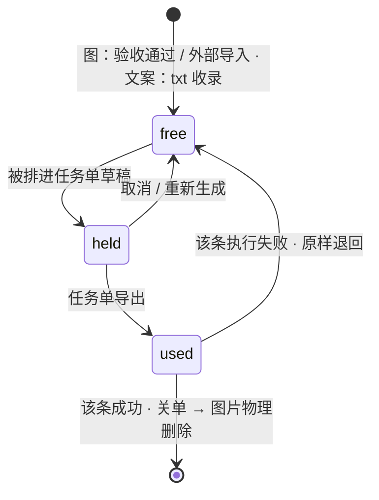

# 图文发布链路重构 · 技术方案与执行计划

> **文档关系**
> - `图文发布链路重构.md`（2026-07-29 需求）：**部分失效**，顶部已标注被推翻的五条。
> - `~/Documents/自动发布/publisher/docs/任务单规范.md`（v3 长表）：RPA 侧的上游规范。
>   本方案**在字段语义上继承它，在载体上取代它**（CSV 长表 → JSON），理由见 §3.1。
> - 本文：**唯一实施依据**。技术路线（§2–§4）· 执行计划（§5）· 验收清单（§6）。
>
> 标记：**【定】** 已确认 · **【默】** 默认值可推翻 · **【待】** 未定。

---

## 1. 目标与非目标

### 1.1 一句话

把「图片 + 标题 + 正文 + 话题」四池按商品维度管起来，每天自动组成 N 篇内容，
人工过目后导出成 RPA 能直接执行的任务包，并把执行结果收回来结算素材。

### 1.2 本期目标

| # | 目标 | 可验证的判据 |
|---|---|---|
| G1 | 商品成为根实体 | 任一 SKU / 标题 / 正文 / 话题组 / 任务单都能溯源到唯一商品 |
| G2 | 图片素材库 | 内部验收图与外部导入图入同一池，均带 SKU；能一眼看到每个 SKU 剩多少张可用 |
| G3 | 文案自动入池 | skill 落盘 txt → watcher 自动收录拆解 → 标题/正文分别进池，零人工录入 |
| G4 | 每日自动组稿 | 按配置生成当天草稿，图片文案不重复、混合篇每 SKU 恰一张 |
| G5 | 排期不撞车 | 全局求解；同平台最小间隔达标；排不下时报错而非硬塞 |
| G6 | 人易读的确认关卡 | 整篇预览所见即所发，可改任一处，重新生成不覆盖手改 |
| G7 | 机器易读的交付 | 任务包 JSON，RPA 无需解析表格；导出前逐平台校验全过 |
| G8 | 结算闭环 | 回执收回 → 成功删图、失败退回可用 |

### 1.3 非目标（本期明确不做）

视频发布 · 多账号 · 发布日历 / 历史回看 · 图库余量预警 · 草稿箱盘点。

最后一条是**固有盲区**：RPA 只负责把内容定时提交，是否真发出去、链接是什么，
软件不知道。当日报告只反映「提交情况」。

---

## 2. 领域模型

### 2.1 层级

```
商品 product（A / B / C，彼此完全不同）
 ├─ SKU（A-SKU1 … A-SKU10）──→ 图片素材库（一张图属于一个 SKU）
 │                             └─ 音乐搜索关键词【定】挂在 SKU 上
 ├─ 标题池 / 正文池 ──────────→ 商品级
 ├─ 话题标签库 ───────────────→ SKU 组合专用 > 商品专用 > 通用（三档匹配）
 ├─ 挂车信息（商品链接 / 短标题）→ 商品级
 ├─ 参与平台 ─────────────────→ 商品级（任务单配置可覆盖）
 └─ 任务单 ───────────────────→ 一天 × 一商品 = 一张
```

### 2.2 三条推导结论

不是新决定，是前面条件的必然后果，记下来免得被当成可选项：

1. **混合篇只能是同商品内跨 SKU。** 跨商品混不了——文案、挂车链接都不同。
2. **热/温/冷分层留在 SKU 上，商品不分层。** 一商品一张单，商品之间不争名额。
3. **排期必须跨任务单全局求解。** 单账号 + 多商品 → 同一个抖音账号一天要发
   `Σ(各商品篇数)` 条，各商品各排各的必然撞车。

### 2.3 素材的一生

图片与文案走**完全相同**的状态机（都是 AI 产物，不心疼）：



- **成功用掉的才永久淘汰**——这条本身就是防重复，不需要冷却期或使用计数
- **删除在关单之后**——导出即删的话，失败时没有素材可退
- 失败退回后是**重新组合**，不是原样重发；不建「失败素材库」

---

## 3. 交付契约

### 3.1 为什么是 JSON 而不是 CSV 长表

v3 长表有三个成本，换 JSON 后**结构性消失**（不是「绕开」，是不再存在）：

| v3 的问题 | JSON 下 |
|---|---|
| `.foreignColumn` 规则：列名前缀不匹配本行平台 → 必须为空 | **不需要**。抖音行只有 `douyin` 对象，别的平台的键根本不出现 |
| 「快手行标题必须为空」用空单元格表达，与「标题恰好没写」无法区分 | `"title": null` 与 `"title": ""` 是两回事 |
| 正文含换行和逗号 → CSV 引号转义是持续的出错源 | JSON 字符串天然安全 |

代价：RPA 侧要改读取端。这是一次性的，且比长期维护 26 列的引号转义便宜。

### 3.2 任务包结构

```
<导出根>/A商品-任务单-2026-08-02/
├── 任务单.json          ← GenDesk 写，RPA 只读
├── 图片/
│   ├── C260802-A-01/01.jpg  02.jpg …
│   └── C260802-A-02/…
├── 执行说明.md          ← 给人看的
├── 回执.jsonl           ← RPA 追加写，GenDesk 不碰
└── READY.txt            ← 一切就绪后**最后**写；RPA 见到它才开工
```

READY.txt 最后写这条是硬约束：否则 RPA 可能读到只准备了一半的包。

### 3.3 `任务单.json`

```jsonc
{
  "schema": "gendesk.tasksheet/1",
  "sheetId": "A-20260802",
  "product": { "code": "A", "name": "NFC音乐挂件" },
  "generatedAt": "2026-08-01 22:10",
  "tasks": [
    {
      "taskId": "T260802-A-01-抖音",      // 全局唯一 = 执行单位 = 回执主键
      "contentId": "C260802-A-01",        // 同一篇的各平台任务共享
      "platform": "抖音",                  // 抖音|小红书|视频号|快手
      "mode": "图文",
      "scheduledAt": "2026-08-02 09:15",  // 本地时区，yyyy-MM-dd HH:mm
      "title": "黄星蓝色NFC音乐挂件",       // 快手恒为 null（图文无标题框）
      "description": "把喜欢的旋律带在身边…",
      "topics": ["#NFC音乐挂件", "#追星好物"],
      "imagePaths": ["…/图片/C260802-A-01/01.jpg", "…/02.jpg"],  // 有序，绝对路径
      "coverPath": "…/01.jpg",            // 仅抖音有值，其余平台键不出现
      "musicKeyword": "黄星",              // 仅抖音/视频号，其余键不出现
      "cart": true,
      "douyin": {                          // 仅 platform=抖音 时出现
        "productUrl": "https://…",
        "shortTitle": "NFC音乐挂件",
        "visibility": "公开",
        "allowSave": false
      },
      "note": "商品A · SKU A-SKU1, A-SKU3"  // 纯给人看，程序不读
    }
  ]
}
```

平台专属对象（**只出现在对应平台的任务上**）：

| 键 | 平台 | 字段 | 本次定的默认值【定】 |
|---|---|---|---|
| `douyin` | 抖音 | `productUrl` `shortTitle` `visibility` `allowSave` | 公开 / 不允许保存 |
| `xhs` | 小红书 | `original` `allowCoCreate` `allowCopy` | 原创 / 不允许合拍 / 不允许复制正文 |
| `shipinhao` | 视频号 | `location` | 不显示位置 |
| — | 快手 | 无专属设置 | — |

### 3.4 `回执.jsonl`（RPA 写）

一行一条，**追加写**。崩在半路时，已写完的行仍然有效——这是选 jsonl 不选单个 JSON 的理由。

```jsonc
{"taskId":"T260802-A-01-抖音","status":"已完成","failKind":null,"message":"草稿已存","finishedAt":"2026-08-02 09:16"}
{"taskId":"T260802-A-01-快手","status":"失败","failKind":"登录失效","message":"cookie 过期","finishedAt":"2026-08-02 13:31"}
```

| 字段 | 取值 |
|---|---|
| `status` | `已完成` / `失败`（未出现在文件里的即「待执行」） |
| `failKind` | 登录失效 / 风控拦截 / 素材不合规 / 页面变更 / 网络超时 / 其他 |
| `message` | 失败详情或草稿位置 |
| `finishedAt` | `yyyy-MM-dd HH:mm` |

**回写落在独立文件而不是原任务单里**，因此：RPA 不必「解析 → 改 → 保序写回」一个含
长正文的结构；GenDesk 也永远不会读到被改坏的任务单。

**重导出保护**：`回执.jsonl` 存在且非空 → 拒绝覆盖导出，必须先收回结果。

### 3.5 导出前校验（逐任务）

v3 §3 的规则表镜像进 Rust。结构类规则已由 §3.1 消解，剩下的是取值类：

| 规则 | 抖音 | 小红书 | 视频号 | 快手 |
|---|---|---|---|---|
| `title` | 必填 ≤20 | 必填 ≤20 | 必填 ≤22 | **必须 null** |
| `description` | 必填 ≤1000 | ≤1000 | ≤1000 | 必填 **≤500** |
| `imagePaths` | 非空、文件存在、≤18 张 | 同左 | 同左 | 同左 |
| `coverPath` | 必填、文件存在 | 键不得出现 | 键不得出现 | 键不得出现 |
| `musicKeyword` | 可填 | 键不得出现 | 可填 | 键不得出现 |
| `douyin.productUrl/shortTitle` | `cart=true` 时必填，短标题 ≤10 | — | — | — |
| `scheduledAt` | ∈ [导出时刻+2h, +14d] | 同左 | 同左 | 同左 |

**软件这边不拦，RPA 会在整批开跑前拦**——那时人已经不在电脑前了。这是本期把
「平台限制校验暂不做」推翻的唯一理由。

### 3.6 软件内的人易读视图

导出格式与查看格式**彻底分开**【定】。任务单页按内容分组呈现，一篇一张卡：

```
┌ C260802-A-01 · 单款篇 · A-SKU1 ──────────────────┐
│ [图][图][图][图][图]   ← 缩略图，可拖拽改序、点击换图 │
│ 标题：黄星蓝色NFC音乐挂件            〔换一条〕      │
│ 正文：把喜欢的旋律带在身边…           〔换一条〕      │
│ 话题：#NFC音乐挂件 #追星好物          〔换一组〕      │
│ 抖音 09:15 · 小红书 10:40 · 视频号 12:05 · 快手 13:30│
└──────────────────────────────────────────────────┘
```

导出后同一页转为只读，各平台时刻旁显示回执状态（待执行 / 已完成 / 失败+原因）。

---

## 4. 技术设计

### 4.1 数据模型

**迁移从 `0035` 起，forward-only。** 遵循仓库既有约定：**废弃列一律保留不读不写**；
废弃**表**直接 DROP（本期发布数据无保留价值——§1.3 已定不做历史回看）。

> ⚠️ DROP 前提：`asset_packs` / `daily_sets` / `usage_ledger` / `accounts` /
> `publish_tasks` / `task_sheets` 六张表将被删除，**历史发布记录不迁移**。
> 执行前先在真实库副本上跑 `foreign_key_check` + `integrity_check`，
> 并用 `commands::backup` 出一份备份。

#### 0035_products.sql — 商品

```sql
CREATE TABLE products (
  id                 INTEGER PRIMARY KEY,
  code               TEXT NOT NULL UNIQUE,        -- ASCII 短码，进任务ID
  name               TEXT NOT NULL,
  platforms_json     TEXT NOT NULL DEFAULT '[]',  -- 参与平台，四选 N
  cart_enabled       INTEGER NOT NULL DEFAULT 0 CHECK (cart_enabled IN (0,1)),
  douyin_product_url TEXT NOT NULL DEFAULT '',
  douyin_short_title TEXT NOT NULL DEFAULT '',
  status             TEXT NOT NULL DEFAULT 'active',
  note               TEXT NOT NULL DEFAULT '',
  created_at INTEGER NOT NULL,
  updated_at INTEGER NOT NULL
);
ALTER TABLE skus ADD COLUMN product_id    INTEGER REFERENCES products(id);
ALTER TABLE skus ADD COLUMN music_keyword TEXT NOT NULL DEFAULT '';
-- skus.platforms_json / skus.topics_json 就此废弃：保留不读不写
```

#### 0036_image_assets.sql — 图片素材库

```sql
CREATE TABLE image_assets (
  id         INTEGER PRIMARY KEY,
  sku_id     INTEGER NOT NULL REFERENCES skus(id),
  path_rel   TEXT NOT NULL UNIQUE,          -- RelPath，导出是唯一绝对路径转换点
  thumb_rel  TEXT NOT NULL,
  source     TEXT NOT NULL CHECK (source IN ('works','import')),
  work_id    INTEGER,                       -- source=works 时指回 accepted_works
  state      TEXT NOT NULL DEFAULT 'free' CHECK (state IN ('free','held','used')),
  post_id    INTEGER,
  created_at INTEGER NOT NULL,
  updated_at INTEGER NOT NULL
);
CREATE INDEX idx_image_assets_pick ON image_assets(sku_id, state);
ALTER TABLE prompt_groups  ADD COLUMN sku_id INTEGER REFERENCES skus(id);
ALTER TABLE accepted_works ADD COLUMN sku_id INTEGER REFERENCES skus(id);
```

#### 0037_copy_to_product.sql — 文案与话题上移

```sql
ALTER TABLE text_items ADD COLUMN product_id INTEGER REFERENCES products(id);
ALTER TABLE text_items ADD COLUMN state      TEXT NOT NULL DEFAULT 'free'
                                  CHECK (state IN ('free','held','used'));
ALTER TABLE text_items ADD COLUMN post_id    INTEGER;
-- text_items.sku_id 废弃：保留不读不写（迁移期用它回填 product_id）
UPDATE text_items SET product_id =
  (SELECT product_id FROM skus WHERE skus.id = text_items.sku_id);

CREATE TABLE topic_groups (
  id           INTEGER PRIMARY KEY,
  product_id   INTEGER REFERENCES products(id),   -- scope=general 时可 NULL
  scope        TEXT NOT NULL CHECK (scope IN ('combo','product','general')),
  sku_ids_json TEXT NOT NULL DEFAULT '[]',        -- scope=combo 时的 SKU 集合
  tags_json    TEXT NOT NULL DEFAULT '[]',
  enabled      INTEGER NOT NULL DEFAULT 1 CHECK (enabled IN (0,1)),
  created_at INTEGER NOT NULL,
  updated_at INTEGER NOT NULL
);
```

#### 0038_sheets.sql — 任务单

```sql
DROP TABLE IF EXISTS publish_tasks;
DROP TABLE IF EXISTS daily_sets;
DROP TABLE IF EXISTS task_sheets;
DROP TABLE IF EXISTS asset_packs;
DROP TABLE IF EXISTS usage_ledger;
DROP TABLE IF EXISTS accounts;

CREATE TABLE sheet_configs (
  id              INTEGER PRIMARY KEY,
  product_id      INTEGER NOT NULL REFERENCES products(id),
  name            TEXT NOT NULL,
  sku_scope_json  TEXT NOT NULL DEFAULT '[]',   -- 空 = 该商品全部 SKU
  platforms_json  TEXT NOT NULL DEFAULT '[]',   -- 空 = 跟随商品
  posts_per_day   INTEGER NOT NULL DEFAULT 5,
  images_per_post INTEGER NOT NULL DEFAULT 5,
  mixed_count     INTEGER NOT NULL DEFAULT 1,
  anchors_json    TEXT NOT NULL DEFAULT '[]',   -- ["10:00","14:00","18:00",…]
  jitter_min      INTEGER NOT NULL DEFAULT 15,
  min_gap_min     INTEGER NOT NULL DEFAULT 3,   -- 同平台最小间隔
  target_day      TEXT NOT NULL DEFAULT 'next' CHECK (target_day IN ('next','same')),
  enabled         INTEGER NOT NULL DEFAULT 1 CHECK (enabled IN (0,1)),
  created_at INTEGER NOT NULL,
  updated_at INTEGER NOT NULL
);

CREATE TABLE task_sheets (
  id          INTEGER PRIMARY KEY,
  date        TEXT NOT NULL,
  product_id  INTEGER NOT NULL REFERENCES products(id),
  config_id   INTEGER NOT NULL REFERENCES sheet_configs(id),
  title       TEXT NOT NULL,                  -- A商品-任务单-2026-08-02
  status      TEXT NOT NULL DEFAULT 'draft'
              CHECK (status IN ('draft','confirmed','exported','reconciling','closed')),
  export_dir  TEXT,
  shortage_json TEXT NOT NULL DEFAULT '[]',
  report_json TEXT,
  exported_at INTEGER, closed_at INTEGER,
  created_at INTEGER NOT NULL, updated_at INTEGER NOT NULL,
  UNIQUE(date, product_id)
);

CREATE TABLE posts (
  id           INTEGER PRIMARY KEY,
  sheet_id     INTEGER NOT NULL REFERENCES task_sheets(id) ON DELETE CASCADE,
  content_code TEXT NOT NULL UNIQUE,          -- C260802-A-01
  seq          INTEGER NOT NULL,              -- 篇序，决定取哪个锚点
  kind         TEXT NOT NULL CHECK (kind IN ('single','mixed')),
  title_id     INTEGER REFERENCES text_items(id),
  body_id      INTEGER REFERENCES text_items(id),
  topics_json  TEXT NOT NULL DEFAULT '[]',
  edited       INTEGER NOT NULL DEFAULT 0 CHECK (edited IN (0,1)),
  UNIQUE(sheet_id, seq)
);

CREATE TABLE post_images (
  post_id  INTEGER NOT NULL REFERENCES posts(id) ON DELETE CASCADE,
  asset_id INTEGER NOT NULL REFERENCES image_assets(id),
  ord      INTEGER NOT NULL,                  -- 0 起；0 号即封面
  PRIMARY KEY (post_id, ord)
);

CREATE TABLE publish_tasks (
  id           INTEGER PRIMARY KEY,
  sheet_id     INTEGER NOT NULL REFERENCES task_sheets(id) ON DELETE CASCADE,
  post_id      INTEGER NOT NULL REFERENCES posts(id) ON DELETE CASCADE,
  task_code    TEXT NOT NULL UNIQUE,          -- T260802-A-01-抖音
  platform     TEXT NOT NULL,
  scheduled_at TEXT NOT NULL,                 -- 'yyyy-MM-dd HH:mm' 本地时区
  status       TEXT NOT NULL DEFAULT 'pending'
               CHECK (status IN ('pending','done','failed')),
  fail_kind    TEXT, result_msg TEXT, result_time INTEGER,
  updated_at   INTEGER NOT NULL
);
CREATE INDEX idx_ptasks_sheet ON publish_tasks(sheet_id);
```

#### 0039_drop_bilibili.sql — 删 B 站

```sql
DELETE FROM text_items WHERE platform = 'bilibili';
UPDATE settings SET value = replace(value, '"bilibili",', '')
  WHERE key LIKE 'publish.%';   -- 平台矩阵设置里的残留
```

枚举变体删除后，库里残留 `'bilibili'` 会让 `Platform::from_str` 报错——
这条迁移是**保护**，不是清洁工作。

### 4.2 后端模块

```
publish/
├── product.rs      新  商品与 SKU 的读写（薄）
├── assets.rs       新  图片素材库：入池 / 状态迁移 / 按 SKU 余量统计
├── composer.rs     新  组稿（纯函数）——单款篇/混合篇/文案抽取/话题匹配
├── schedule.rs     重写 排期（纯函数）——锚点 + 抖动 + 全局求解
├── validate.rs     新  导出前逐平台校验（纯函数，§3.5 的镜像）
├── sheet_json.rs   新  任务单 JSON 序列化（契约单点）
├── receipt.rs      新  回执 jsonl 解析（纯函数）
├── exporter.rs     重写 任务包物化：图片拷贝 + JSON + 说明 + READY.txt
├── settle.rs       重写 结算：成功删图 / 失败退回（原 reconcile.rs）
├── ticker.rs       改  一天一张 → 每个启用配置各一张
├── inbox/          改  素材包投递删除；文案投递改商品级 + 自动收录
├── paths.rs        留  RelPath
├── platform.rs     改  删 Bilibili，其余映射单点不动
└── restock.rs      留  补料提示词，输入改为「商品缺文案 / SKU 缺图」
```

**纯函数与 IO 严格分开**：`composer` / `schedule` / `validate` / `sheet_json` /
`receipt` 五个模块**不碰 DB、不碰文件系统**，输入是结构体、输出是结构体。
CI 的覆盖率闸门（publish 纯逻辑 ≥ 85% 行）就压在这五个上。

### 4.3 排期算法

```
输入：某日全部任务单的全部篇（跨商品）+ 各自配置的锚点/抖动/最小间隔 + 导出时刻
输出：每个 (篇, 平台) 一个时刻 —— 或 Err(排期拥挤)

1. 对每篇按 seq 取锚点：anchors[seq % len(anchors)]
2. 窗口 = [锚点 - jitter, 锚点 + jitter]，按 target_day 落到当日或次日
3. 该篇的各参与平台在窗口内取互不相同的分钟
4. 全局约束：同平台任意两条间隔 ≥ min_gap_min
5. 冲突则在窗口内重摇（有限次），仍不成 → Err 并列出拥挤的锚点
6. 全体时刻必须 ∈ [导出时刻 + 2h, 导出时刻 + 14d]
```

**排不下时报错，不硬塞**。静默压缩间隔等于自己制造自动化特征——
四个平台在同一分钟发同一条内容本身就是风控信号（v3 §2.6）。

`target_day` 默认次日的硬理由：当天 17:00 生成 18:00 的单会被 RPA 的
`now+2h` 下限直接拒收。

### 4.4 组稿算法

```
1. 在配置的 SKU 范围内，筛出 free 图片数 ≥ images_per_post 的 SKU
2. 按分层排序（热 → 温 → 冷）分配 posts_per_day 个名额
3. mixed_count 篇为混合篇：挑 images_per_post 个不同 SKU，每个各出一张
   其余为单款篇：从该 SKU 取 images_per_post 张
4. 从商品的 free 标题 / 正文各抽一条（同一张单内不重复）
5. 话题匹配：SKU 组合专用 → 商品专用 → 通用兜底
6. 图片与文案置 held，写 post_id
7. 重新生成时：edited=1 的篇原样保留，其余释放 held 后重组
```

某 SKU 图片不足或商品文案不足 → 该 SKU 当天不参与，名额顺延，
缺口写进 `shortage_json` 并在页面上提示。

### 4.5 事务粒度

沿用 `accept_tasks` 的既有教训——**拷贝无法回滚，所以先拷完再写库**：

| 动作 | 事务边界 |
|---|---|
| 生成草稿 | 单事务（纯 DB：posts + post_images + 素材置 held） |
| 导出任务包 | **不做单事务**：先把图片全部拷完 + 写 JSON + 写说明，任一步失败则一行库都不写、并清理半成品目录；全部成功后单事务置 exported + 素材 held→used + 写 READY.txt |
| 收回回执 | 单事务（publish_tasks 状态 + 失败素材 used→free） |
| 关单 | 先删文件后写库？**否**——先单事务置 closed 并记下待删清单，再删文件；删失败只是留下垃圾文件，不会丢状态 |

### 4.6 前端

| 页面 | 路由 key | 快捷键 | 说明 |
|---|---|---|---|
| 商品 | `products` | null | 商品 + SKU + 挂车信息 + 参与平台 |
| 文案库 | `copy` | null | 三个 tab：标题 / 正文 / 话题组 |
| 图片素材库 | `images` | **9** | 接替「资产库」的槽位 |
| 任务单 | `sheets` | **0** | 接替「发布计划」的槽位 |
| 设置 | `settings` | 8 | 新增「平台档案」段 |

**⌘9 / ⌘0 是槽位继承，不是重排**——资产库→图片素材库、发布计划→任务单是同位替换，
既有页面的数字一个不动（`⌘5` 继续空着）。新页 `products` 无数字快捷键。

`routes.test.ts` 会随之改动。**这是路由表本身变了，不是为让 CI 变绿放宽断言**——
按仓库规则，在测试注释与 PR 描述里写明。

**四库统一交互**【定】：多选（Shift 连选 · ⌘ 点选 · ⌘A 全选）· 批量删除 / 启停 /
改归属 · 就地编辑 · 快捷键（Delete 删、Enter 编辑、Esc 取消、方向键移焦点）。
抽成 `features/_shared/useListSelection.ts`，四个页面只提供列渲染——
四份各写各的必然分叉。

### 4.7 素材入库

**图片**两个来源入同一池：

- 内部：提示词组上指定 SKU → 生图 → 验收通过 → 自动写 `image_assets(source=works)`
- 外部：选文件夹导入 → 按目录名匹配 SKU 编码 / 别名，匹配不到在对话框内手动指认【默】

**文案**沿用 `docs/收件箱收录格式规范.md` 的 txt 契约，三处改动：

1. 文件头 `【SKU】` → `【商品】`
2. 目录 `收件箱/<SKU编码>/` → `收件箱/<商品码>/`
3. watcher 监听新增 txt **自动收录**，复用 `publish::inbox::watcher::coalesce` 的防抖；
   收录后原文件移入 `已收录/`

txt 内部格式不变：`【类型】标题` 一行一条；`【类型】正文` 用单独一行 `====` 分隔。
识别不到商品 → 进「待认领」，文件保留原位不丢弃。

---

## 5. 执行计划

六期，每期 = 一分支 = 实现 + 测试 + `pnpm check` 全绿 + `/code-review` 通过 = 一次 merge。

### P0 · 商品模型

- 迁移 `0035`；`db/repo/products.rs`；`commands/publish_products.rs`
- 商品管理页（商品 CRUD + SKU 挂到商品 + 挂车信息 + 参与平台）
- `sku_mapping.rs` 批量建档表加「所属商品」列
- 存量 SKU 回填：页面上提供「批量指定商品」

### P1 · 图片素材库 ⚠️ 唯一有时间成本的一期

- 迁移 `0036`；`publish/assets.rs`；`prompt_groups.sku_id` 与生成页选择器
- 验收通过 → 自动入池（挂进 `accept_tasks` 的既有流程，**不新开事务**）
- 外部文件夹导入
- 图片素材库页（按 SKU 分组 · 余量 · 状态筛选 · 四库统一交互）

> **为什么必须先做**：款式在生图时指定、验收后归位。今天之后验收的图才有 SKU，
> **存量图只能手工补标**。其余各期什么时候做成本都一样。

### P2 · 文案库与话题库

- 迁移 `0037`；`text_items` 上移商品 + 状态机；`topic_groups` 三档
- 收件箱重构：素材包投递删除；文案 watcher 自动收录 + 拆解
- 文案库页三 tab；`useListSelection` 抽取

### P3 · 任务单配置 · 组稿 · 排期

- 迁移 `0038`；`sheet_configs` 与配置页
- `composer.rs` / `schedule.rs` 纯函数 + proptest
- `ticker.rs` 改为按启用配置逐个生成
- 删除 `frequency.rs` / `runway.rs` / `set_picker.rs`

### P4 · 确认页

- 任务单页：整篇预览、换标题 / 正文 / 话题 / 图、增删篇、整单重生成
- `edited` 保护；`shortage_json` 提示
- 删除 `AssetsPage.tsx`、重写 `PlanPage.tsx`

### P5 · 导出 · 校验 · 结算

- 迁移 `0039`（删 B 站）
- `validate.rs` / `sheet_json.rs` / `receipt.rs` / `exporter.rs` / `settle.rs`
- 删除 `xlsx/`、`reconcile.rs` 旧分支
- 与 RPA 侧联调：先导一包 dry-run

---

## 6. 验收清单

逐条可勾。**每条都是可执行的检查，不是「做完了」这种自我声明。**

### P0 商品模型

- [ ] 新建商品 A/B，各挂若干 SKU；`SELECT` 任一 SKU 能查到唯一 product_id
- [ ] 商品的参与平台可四选 N，存进 `platforms_json`
- [ ] 挂车关闭时，商品链接与短标题两个输入框禁用（不是隐藏——隐藏会让人以为没这功能）
- [ ] 短标题超 10 字当场提示，不等到导出
- [ ] 批量建档表带「所属商品」列，导入后 SKU 正确归属
- [ ] `cargo test --lib publish::product::` 全绿

### P1 图片素材库

- [ ] 提示词组上能指定 SKU；生成页选择器展示该 SKU
- [ ] 跑一批图 → 验收通过 → 图自动出现在素材库对应 SKU 下，状态 `free`
- [ ] 外部文件夹导入：目录名等于 SKU 编码时自动归位；不匹配时弹出手动指认
- [ ] 素材库页一眼可见每个 SKU 的 free 数量
- [ ] 多选 + 批量删除 + 批量改 SKU 可用；Delete / ⌘A / Shift 连选生效
- [ ] 废纸篓还原一张图后，它回到素材库且状态为 `free`
- [ ] `image_assets.path_rel` 全部是 RelPath，无绝对路径入库

### P2 文案库与话题库

- [ ] 往收件箱丢一个 `标题.txt`，**无需任何点击**，标题在数秒内进池
- [ ] 正文 txt 的 `====` 分隔被正确拆成多条
- [ ] 文件头 `【商品】` 识别；识别不到 → 进「待认领」且原文件不动
- [ ] 收录成功后原文件移入 `已收录/`
- [ ] 同一文件重复投递不产生重复条目
- [ ] 话题三档匹配：给某 SKU 组合配一组，组稿时优先于商品组
- [ ] 三个 tab 的多选 / 批量 / 编辑 / 快捷键行为一致（同一个 hook）

### P3 组稿与排期

- [ ] 配置「每天 5 篇 / 每篇 5 图 / 1 篇混合 / 锚点 10:00,14:00,18:00」→ 生成的草稿符合
- [ ] 混合篇的 5 张图来自 5 个**不同** SKU，每 SKU 恰 1 张
- [ ] 同一张单内图片、标题、正文均不重复
- [ ] 某 SKU 图片不足 → 该 SKU 不参与，名额顺延，缺口进 `shortage_json` 并在页面显示
- [ ] 生成后被选中的图片与文案状态为 `held`
- [ ] 重新生成：`edited=1` 的篇内容一字不变；其余篇的素材被释放回 `free`
- [ ] **排期 proptest 五条不变量**：① 每个时刻落在 `[锚点±jitter]` 内 ② 同一篇内各平台时刻两两不同 ③ 同平台任意两条间隔 ≥ `min_gap_min` ④ 全体时刻 ∈ `[now+2h, now+14d]` ⑤ 任务数 = 篇数 × 参与平台数
- [ ] 两个商品配同一锚点 + 篇数塞满 → 返回「排期拥挤」错误并列出冲突锚点，**不静默压缩间隔**
- [ ] `publish` 纯逻辑行覆盖率 ≥ 85%

### P4 确认页

- [ ] 整篇预览：图 + 标题 + 正文 + 话题 + 四平台时刻，与将导出的内容逐字一致
- [ ] 换标题 / 换正文 / 换话题 / 换图（含跨 SKU 手动挑图）均可用
- [ ] 删一篇 / 加一篇可用
- [ ] 改过的篇标记 `edited`，整单重生成后内容不变
- [ ] 草稿态可编辑；已导出态转只读并显示回执状态

### P5 导出与结算

- [ ] 导出目录结构与 §3.2 一致；`READY.txt` 是**最后**写入的文件（用文件 mtime 验证）
- [ ] `任务单.json` 通过 §3.3 的 schema：快手任务 `title` 为 `null`；小红书任务**不含** `coverPath` / `musicKeyword` / `douyin` 键
- [ ] 图片路径为绝对路径且文件真实存在
- [ ] 故意造一条超长的视频号标题（23 字）→ 导出被拦，错误信息指明是哪个 taskId 的哪一项
- [ ] 故意把 `scheduledAt` 排到 1 小时后 → 导出被拦（+2h 下限）
- [ ] 导出成功后素材由 `held` 转 `used`
- [ ] 手写一个 `回执.jsonl`：一条成功 + 一条失败 → 收回后，失败那条的图片与文案回到 `free`，成功那条保持 `used`
- [ ] 回执文件非空时再次导出 → 被拒绝，提示先收回结果
- [ ] 关单 → 成功任务的图片**文件被物理删除**，失败任务的图片仍在
- [ ] 崩溃模拟：回执写到一半（最后一行不完整）→ 解析器跳过残行、其余照常收回
- [ ] 当日报告按失败原因分类统计

### 全局门禁（每期都要）

- [ ] `pnpm check` 九步全绿
- [ ] 改过命令 / 事件 → `cargo test --lib export_bindings` 重生成绑定，**先 `git add` 再跑 check**
- [ ] 非测试代码无 `unwrap` / `expect` / `panic`
- [ ] 新增 class 与 `var(--x)` 均在 `globals.css` 中定义且被使用（`classnames.test.ts`）
- [ ] 迁移在真实库副本上跑过 `foreign_key_check` + `integrity_check`
- [ ] 由**全新上下文**会话执行 `/code-review`（P3/P5 用 high），发现项修复后才 merge

---

## 7. 风险与回退

| 风险 | 处置 |
|---|---|
| `0038` DROP 六张表不可逆 | 迁移前强制 `commands::backup`；且 dev 与打包应用共用 `app_data_dir`，跑过新迁移的库**旧版本再也打不开**（`VersionMissing`）——这是保护，不是故障 |
| RPA 侧未同步改读 JSON | P5 之前不动 RPA；先 dry-run 导一包给对方验证，双方同时切 |
| 存量图片无 SKU | P1 上线即开始有效；存量只能手工补标，**越晚做越多** |
| 排期拥挤在真实数据下频繁触发 | 先按 §4.3 报错暴露出来，再决定是加锚点还是放宽窗口——不静默兜底 |
| 文案 watcher 重复收录 | 沿用 intake 的教训：**记账在动手之前**，按内容哈希去重，不依赖磁盘标记 |

---

## 8. 待定项

| # | 事项 | 现状 |
|---|---|---|
| 1 | 外部图片导入的 SKU 匹配规则 | 【默】目录名匹配编码/别名，不中则手动指认 |
| 2 | 混合篇取哪个 SKU 的音乐关键词 | 【默】首图所属 SKU |
| 3 | 同平台最小间隔 | 【默】3 分钟，配置可改 |
| 4 | 任务包导出根目录 | 【待】沿用现有「执行机根路径」设置项 |
| 5 | RPA 侧改造的时间点 | 【待】与 P5 联调窗口对齐 |
